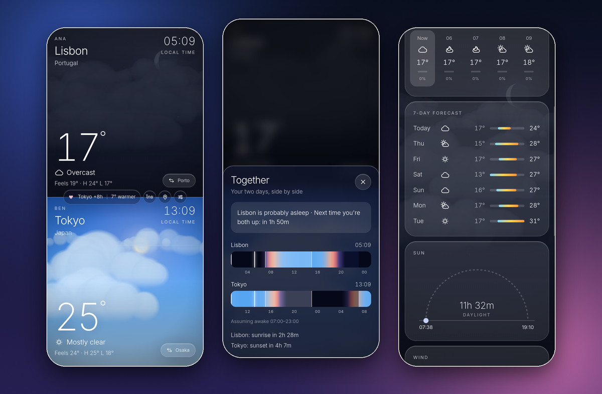
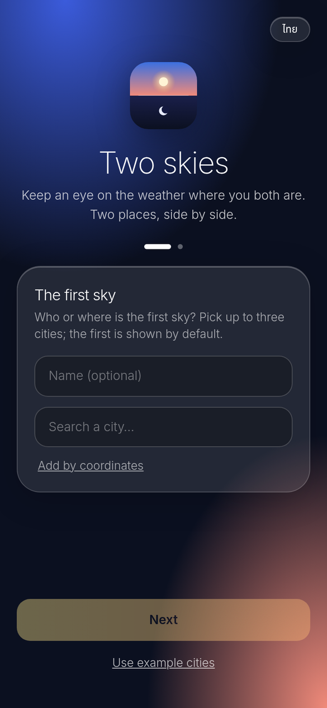
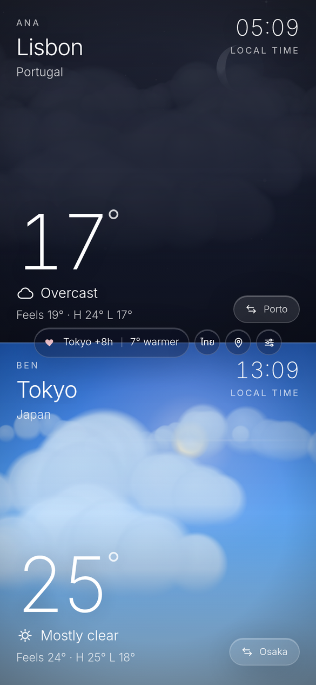
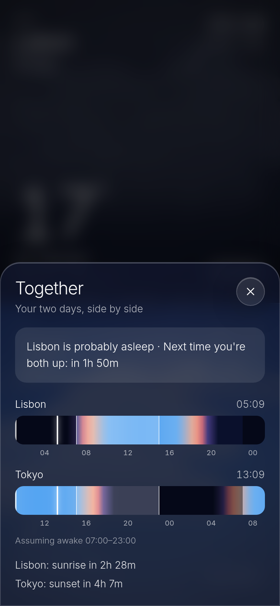
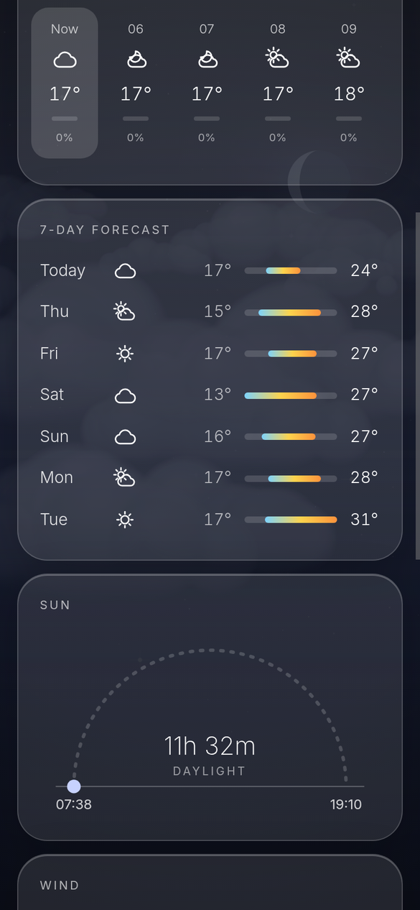
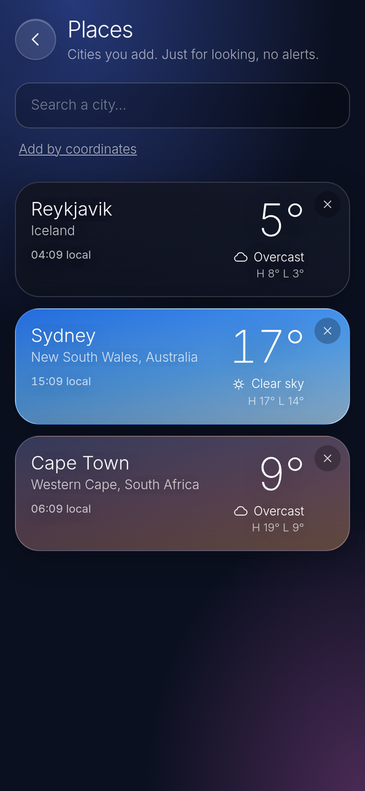
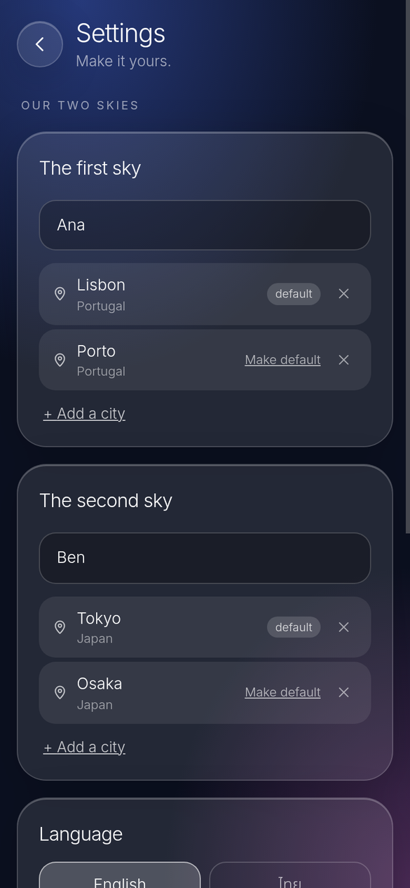
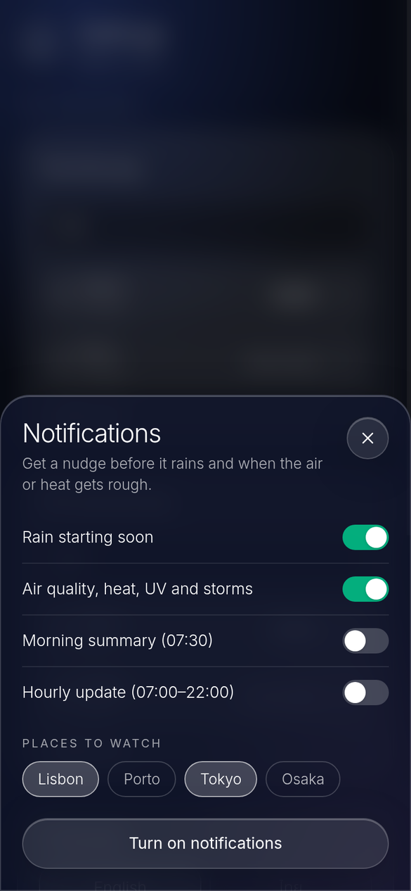
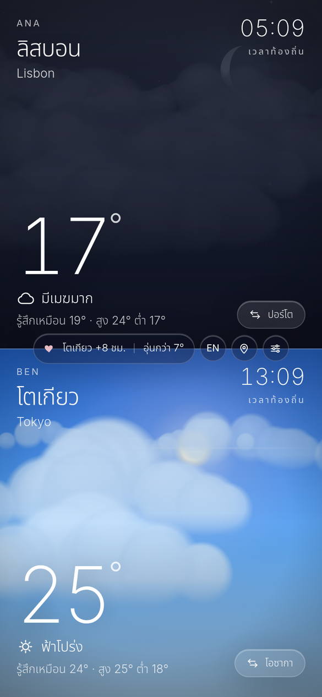
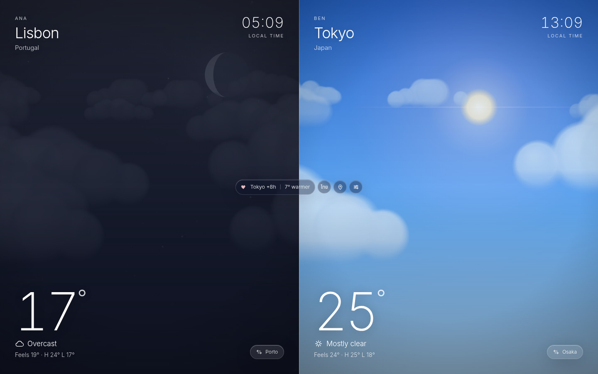

<h1 align="center">Two Skies</h1>
<p align="center"><b>Two cities. Two skies. One glance.</b><br>
A private, installable weather app for two people in two places.</p>

<p align="center"></p>

Two Skies shows the weather where **you** are and where **they** are, side by side, as two living skies. It's built for couples, family and friends who live far apart and keep asking "what's it like there right now?"

- **Two live skies.** Sun, moon, stars, clouds, rain, snow, fog and lightning, driven by the real sun position and current weather at each place. It's often night on one side and day on the other.
- **Together.** Both of your days on one timeline: when each of you is asleep, when you're both awake, and the next sunrise or sunset on either side.
- **Gentle heads-up, not noise.** "Rain in about 25 min", air-quality, heat, humid-heat, UV and thunderstorm warnings, plus an optional hourly update and morning summary as web-push notifications.
- **Yours.** One password, no accounts, no tracking. You host it; your data stays on your server.
- **Installable.** A PWA you add to your home screen, with offline cache and pull-to-refresh.
- **English and Thai** out of the box, easy to add more.
- **Free data.** Weather comes from [Open-Meteo](https://open-meteo.com/); no API key needed.

## Screenshots

<table>
  <tr>
    <td align="center"><br><sub>First run: pick your two skies</sub></td>
    <td align="center"><br><sub>Home</sub></td>
    <td align="center"><br><sub>Together</sub></td>
    <td align="center"><br><sub>Forecast, sun, wind, air quality</sub></td>
  </tr>
  <tr>
    <td align="center"><br><sub>Places: browse any city</sub></td>
    <td align="center"><br><sub>Settings</sub></td>
    <td align="center"><br><sub>Notifications</sub></td>
    <td align="center"><br><sub>Thai interface</sub></td>
  </tr>
</table>

<p align="center"></p>

## Quick start

You need a machine that stays on (a Raspberry Pi, a small VPS, a home server) and a password.

### With Docker (recommended)

```bash
git clone https://github.com/<you>/two-skies.git
cd two-skies
cp .env.example .env        # then edit .env and set TS_PASSWORD
docker compose up -d
```

Open `http://<your-machine>:47318`, sign in, and the welcome screen asks for your two skies. Your setup lives in `./data`, so it survives upgrades (`git pull && docker compose up -d --build`).

### With Node (20.19+)

```bash
git clone https://github.com/<you>/two-skies.git
cd two-skies
npm ci
npm run build
TS_PASSWORD='a long passphrase' npm start
```

To keep it running, use a process manager. Example systemd user unit (`~/.config/systemd/user/two-skies.service`):

```ini
[Unit]
Description=Two Skies
After=network-online.target

[Service]
WorkingDirectory=%h/two-skies
EnvironmentFile=%h/.config/two-skies/env      # contains TS_PASSWORD=...
ExecStart=/usr/bin/node server/server.mjs
Restart=always

[Install]
WantedBy=default.target
```

```bash
systemctl --user enable --now two-skies
loginctl enable-linger "$USER"   # start at boot without logging in
```

## First run

1. Sign in with your password. The session lasts 100 days and renews every visit, so you rarely type it again.
2. The **welcome screen** asks for the first sky, then the second: an optional name ("Ana", "Mum") and up to three cities each. The first city is the default; a swap button appears when a side has more than one. "Use example cities" gets you a working screen in one tap.
3. Change anything later in **Settings** (the sliders button): cities, names, language, waking hours and notifications. The setup is stored on the server, so both phones always agree.

The **pin button** opens **Places**: search any city to keep an eye on it. These are for browsing only and never trigger alerts.

## Configuration

Everything is optional except the password. Set these as environment variables (or in `.env` for Docker).

| Variable | Default | What it does |
|---|---|---|
| `TS_PASSWORD` | _(required)_ | The shared password. Without it the server refuses to serve anything. |
| `TS_PASSWORD_HASH` | | Alternative to `TS_PASSWORD`: a hash in the form `scrypt$<salt hex>$<hash hex>` (32-byte key). |
| `TS_COOKIE_SECRET` | auto | Signs session cookies. If unset, one is generated once and kept in the data folder. |
| `DATA_DIR` | `~/.local/state/two-skies` (`/data` in Docker) | Where your setup and push data are stored. |
| `PORT` / `HOST` | `47318` / `0.0.0.0` | Where the server listens. |
| `VAPID_SUBJECT` | a placeholder URL | A contact (`mailto:` or `https:`) that push services can reach if something goes wrong. Set it to yours. |

**Your data** (all in `DATA_DIR`): `config.json` (your two skies and waking hours), `places.json` (added cities), `push.json` (push keys and subscriptions, mode 600) and `cookie-secret`. Back that folder up; deleting it just means setting things up again.

Sign-in tries are rate limited (5 wrong passwords from one address lock it for 5 minutes).

## HTTPS, installing and notifications

Over plain `http://` on your home network the app works in the browser. For the best experience put it behind **HTTPS**, because:

- phones only offer **Add to Home Screen** as a real app on a secure address, and
- **web-push notifications** need a secure address. On iPhone, add the app to the Home Screen first (iOS 16.4+), then enable notifications from inside it.

Easy ways to get HTTPS without opening ports on your router: [Cloudflare Tunnel](https://developers.cloudflare.com/cloudflare-one/connections/connect-networks/) (point a hostname at `http://localhost:47318`; add Cloudflare Access if you want a second lock) or [Tailscale Serve](https://tailscale.com/kb/1242/tailscale-serve). Any reverse proxy (Caddy, nginx, Traefik) works too. The server understands `X-Forwarded-Proto` and `CF-Connecting-IP`, so the secure cookie flag and the sign-in rate limit behave correctly behind them.

Open **Settings → Notifications** on each phone to turn on what you want: rain starting soon, alerts (air quality, heat, humid heat, thunderstorms), a morning summary, or an hourly update (07:00-22:00 local) that replaces itself so nothing piles up.

## How it works

```
 phone (PWA)                                    your server (Node, no framework)
 ┌──────────────────────────┐   HTTPS   ┌─────────────────────────────────────────────┐
 │ React + Tailwind + Motion│◀────────▶│ password gate · serves the app (brotli/gzip) │
 │ canvas sky engine        │           │ /api/config  your two skies                  │
 │ TanStack Query cache     │           │ /api/places  added cities                    │
 │ service worker (offline, │           │ /api/push/*  subscriptions + scheduler       │
 │ push)                    │           └───────────────┬─────────────────────────────┘
 └───────────┬──────────────┘                           │ every 10 min
             │ forecast / air quality / ensemble        ▼
             └────────────────────────────▶  Open-Meteo (free, no key)
```

- **Sky engine** (`src/sky`): a pure function turns "sun height + weather code + clouds + wind + moon phase" into a palette and layer settings; a canvas renderer draws and cross-fades them. No images.
- **Alerts** (`shared/rules.js`): one set of pure rules used by both the app and the push scheduler: a 15-minute rain nowcast, an ensemble rain chance, and thresholds for air quality (US AQI ≥ 101/151/201), heat (feels-like ≥ 38/41/45 °C), humid heat (wet-bulb ≥ 26/28/30 °C), UV (≥ 8/11) and thunderstorm risk (CAPE ≥ 2500 J/kg with a lifted index ≤ -5). Tune them there.
- **Push** (`server/push.mjs`): standard Web Push with VAPID keys generated on first start. Only your two skies' cities are watched.
- **What the server stores:** your setup and push subscriptions. It never stores weather or logs where you are beyond the cities you chose.

More about the data source, including what the API offers beyond what this app uses: [docs/open-meteo-capabilities.md](docs/open-meteo-capabilities.md).

## Development

```bash
npm ci
npm run dev        # http://localhost:5173, demo mode: example cities, nothing is saved
npm test           # unit tests (rules, sky model, config, push scheduler, ...)
npm run build      # production build into dist/
```

`npm run dev` has no server behind it, so there is no sign-in, saved setup or push; the app shows the example cities. To work on the full stack, build and run `npm start` with a `TS_PASSWORD`.

Useful extras while developing: add `?debug=1` to the URL for a panel that forces the hour, weather and wind (great for checking sunsets, storms and snow), and `&open=settings|places|together|notify` to open a screen directly.

```
src/            React app (components, lib, sky engine)
shared/         rules and messages used by both the app and the server
server/         the Node server: auth, config, places, push
sw/             the service worker (offline shell + push)
tests/          Vitest tests
docs/           notes and screenshots
```

### Adding a language

1. In `src/lib/i18n.tsx`, add the language to `Lang`, add a dictionary typed `Record<Key, string>` (the compiler lists every missing string), register it in `DICT`, and add a `localeFor` entry.
2. In `shared/messages.js`, add the alert, nowcast and weather-label texts (used by the UI and by push notifications).
3. Add a button to the language switcher in `src/components/SettingsPage.tsx` and `CoupleChip.tsx`.

## Good to know

- It is built for **two people**, not many: one shared password, one shared setup.
- The city search can't find neighbourhoods; use "Add by coordinates" for those.
- Fonts are loaded from Google Fonts (`index.html`). If that matters to you, self-host them.
- Open-Meteo's free tier is for **non-commercial** use and asks for attribution, which the app shows in the forecast view. Please keep it.

## Contributing

Issues and pull requests are welcome. Please run `npm test` and `npx tsc -b` before opening a PR.

## License

[MIT](LICENSE). Weather data by [Open-Meteo.com](https://open-meteo.com/) under [CC BY 4.0](https://creativecommons.org/licenses/by/4.0/).
